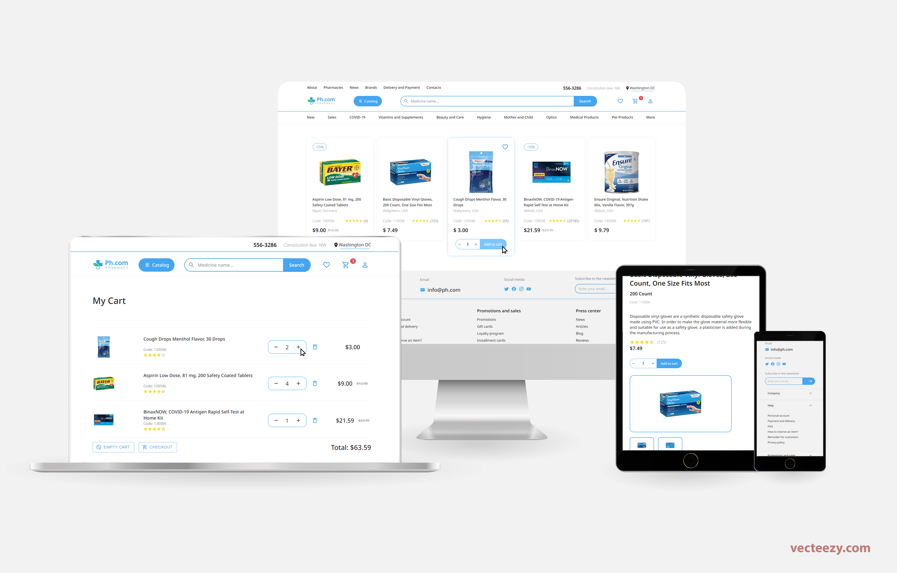
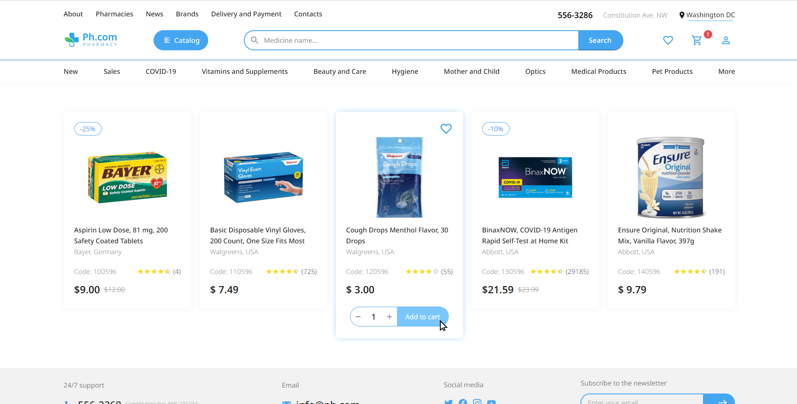

# Ph.com: a React.js e-commerce 

## Table of contents

- [Overview](#overview)
  - [The project](#the-project)
  - [Screenshot](#screenshot)
  - [Links](#links)
- [My process](#my-process)
  - [Built with](#built-with)
  - [What I learned](#what-i-learned)
  - [Continued development](#continued-development)
  - [Useful resources](#useful-resources)
- [Author](#author)
- [Acknowledgments](#acknowledgments)

## Overview

### The project

This is the final project of the React module composing Infnet's Bootcamp syllabus. It is the e-commerce of the fictitious drugstore *Ph*. For the design, I have tried to mix the elements I most liked from two sources (links below). 

The website is responsive and includes a landing page, login and register pages, pages for individual visualization of products and, finally, cart and favorites pages. The customer can add or remove items from cart and favorites. It is also possible to update the quantity of a certain item in cart and the new total price will automatically be recalculated and displayed.

### Screenshot

### Links

- [Solution](https://github.com/Gabriel-Alves-95/ph.com--a-pharmacy-ecommerce)
- [Live](https://ph-pharmacy.netlify.app/)
- [Design 1](https://www.behance.net/gallery/140419689/Phcom-Online-pharmacy-store-E-commerce?tracking_source=search_projects_recommended%7Cpharmacy+website+design)
- [Design 2](https://www.behance.net/gallery/138209439/E-commerce-pharmacy-with-delivery)

## My process

### Built with

- React.js
- React Router
- Material UI

### What I learned

Through the process of developing this e-commerce:

- I needed to create states to store products in *cart* and in *favorites*. But these values were reset every time the customer went into a new page. This problem could be solved if it was possible to define *global states*. After some research on the internet, I found what I was seeking for: React hook *useContext*. After spending some time learning how to use it, I was able to apply this knowledge in the project. 

- I got acquainted with Material UI components and how to style them.

- I have also learned how to change the appearence of numeric inputs in firefox and webkit browsers. 

### Continued development

Future developments for this project include:

- Creation of a database with *products* and *users* tables.

- Development of a REST API to acess and manipulate data from the database: list products, search product by name, register user and login authentication are the basic features to be implemented.

- Modify the landing page to be closer to [Design 1](https://www.behance.net/gallery/140419689/Phcom-Online-pharmacy-store-E-commerce?tracking_source=search_projects_recommended%7Cpharmacy+website+design) and create a catalog page.

### Useful resources

- [React Context for Beginners – The Complete Guide (2021)](https://www.freecodecamp.org/news/react-context-for-beginners/) - This article by Reed Barger helped me understand how to employ *useContext* in my project by giving a step-by-step list of what to do.

## Author

- [Personal Website](https://gabriel-alves-dev.netlify.app/)
- [Frontend Mentor](https://www.frontendmentor.io/profile/Gabriel-Alves-95)
- [Linkedin](https://www.linkedin.com/in/gabriel-alves-webdev/)

## Acknowledgments

I thank all the authors of the designs listed above for sharing them in *Behance*, as well as Reed Barger for sharing his article in *freeCodeCamp.org*.

I thank [Алексей Безродний](https://www.vecteezy.com/members/dezzzzy) for the image with several devices which I used, after some editing, to open this README. I also thank the platform [vecteezy.com](https://www.vecteezy.com/), where I found the aforementioned image.

Last but not least, I thank Ariel Júnior for making the functions *updateCart* and *removeItem* in App.js more readable.